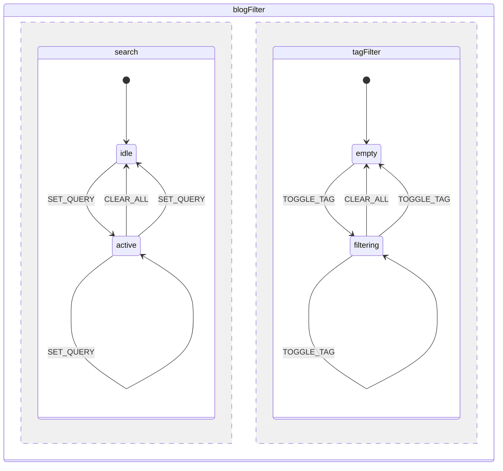
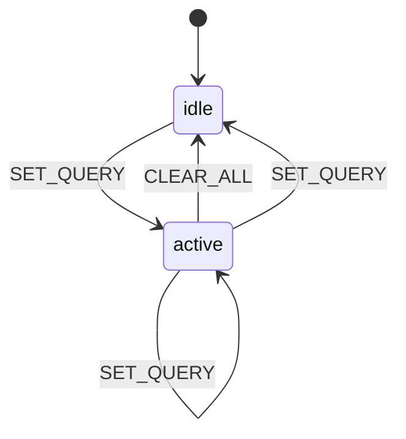
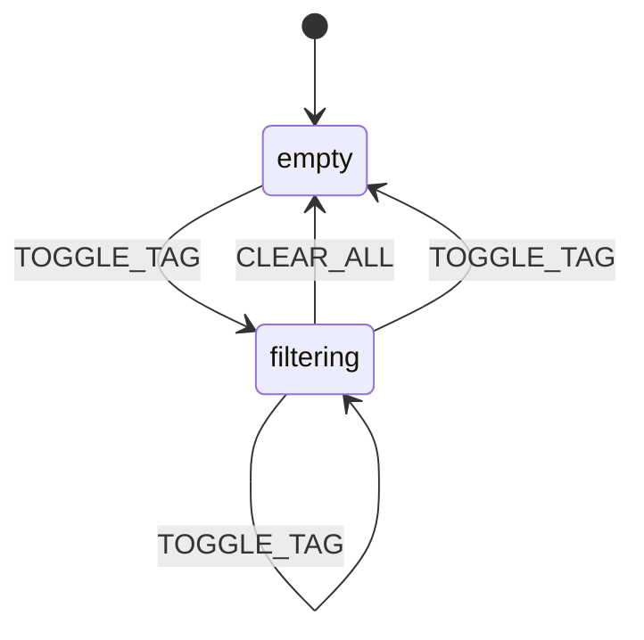
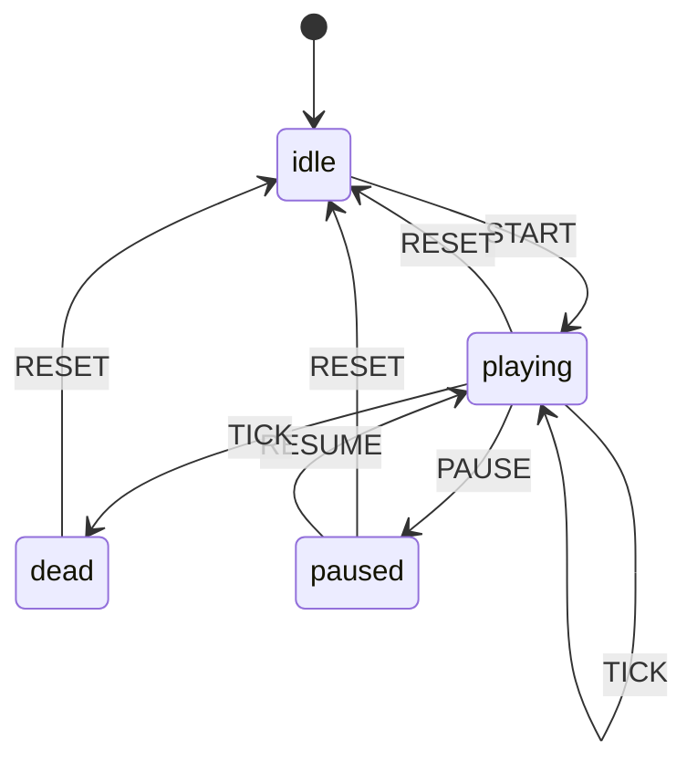

# State Machine Diagrams

> Auto-generated — do not edit directly.
> To regenerate: `pnpm tsx scripts/generate-state-diagrams.ts`
> To add a machine: export it from `apps/vubnguyen/src/machines/index.ts`.
>
> _Last generated: 2026-02-28T07:09:08.038Z_

## Contents

- [blogFilter](#blogfilter)
- [snake](#snake)

---

## blogFilter

**Source:** `apps/vubnguyen/src/machines/blogFilterMachine.ts`  
**Type:** parallel — regions: `search`, `tagFilter`

### Full machine

### `search` region

### `tagFilter` region

## snake

**Source:** `apps/vubnguyen/src/machines/snakeMachine.ts`  
**Type:** compound — states: `dead`, `idle`, `paused`, `playing`

