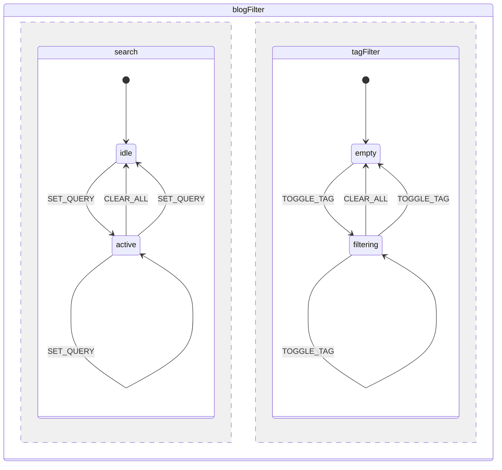
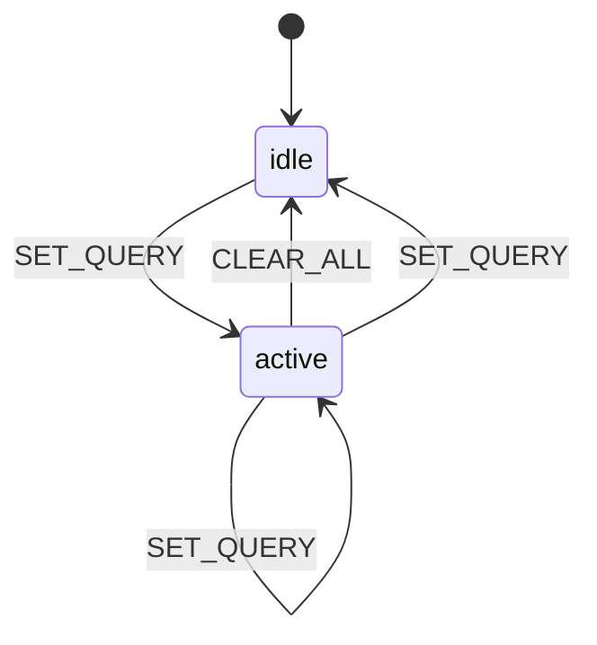
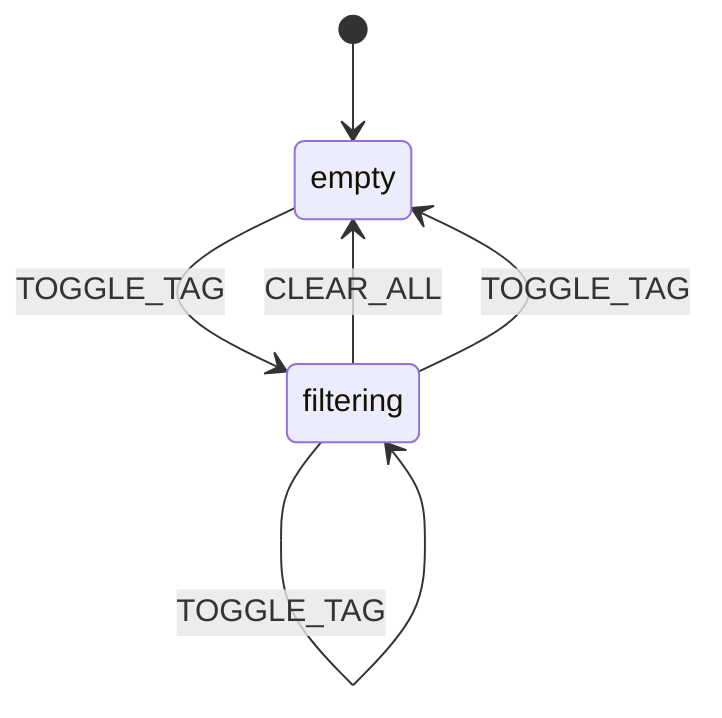
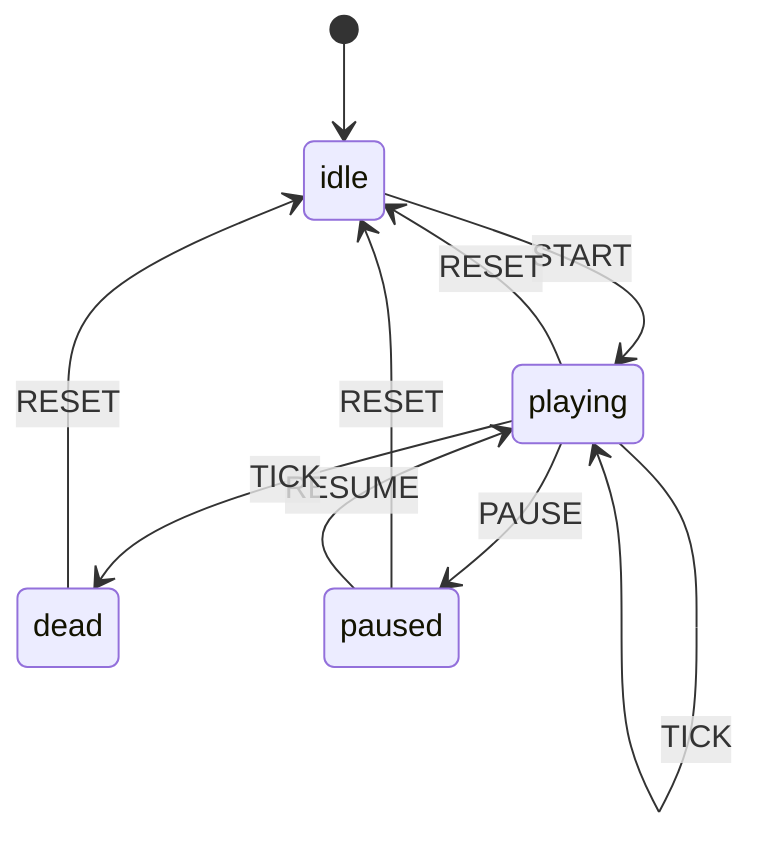

# State Machine Diagrams

> Auto-generated — do not edit directly.
> To regenerate: `pnpm tsx scripts/generate-state-diagrams.ts`
> To add a machine: export it from `apps/vubnguyen/src/machines/index.ts`.
>
> _Last generated: 2026-02-28T09:04:29.765Z_

## Contents

- [blogFilter](#blogfilter)
- [snake](#snake)
- [spaceInvaders](#spaceinvaders)

---

## blogFilter

**Source:** `apps/vubnguyen/src/machines/blogFilterMachine.ts`  
**Type:** parallel — regions: `search`, `tagFilter`

### Full machine



### `search` region



### `tagFilter` region



## snake

**Source:** `apps/vubnguyen/src/machines/snakeMachine.ts`  
**Type:** compound — states: `dead`, `idle`, `paused`, `playing`



## spaceInvaders

**Source:** `apps/vubnguyen/src/machines/spaceInvadersMachine.ts`  
**Type:** compound — states: `gameOver`, `idle`, `paused`, `playing`

```mermaid
stateDiagram-v2
  [*] --> idle
  gameOver --> idle : RESET
  idle --> playing : START
  paused --> idle : RESET
  paused --> playing.active : RESUME
  state playing {
    [*] --> active
    active --> active : FIRE_PLAYER
    active --> active : INPUT_LEFT_DOWN
    active --> active : INPUT_LEFT_UP
    active --> active : INPUT_RIGHT_DOWN
    active --> active : INPUT_RIGHT_UP
    active --> #spaceInvaders.gameOver : TICK
    active --> playerDying : TICK
    active --> levelComplete : TICK
    active --> active : TICK
    levelComplete --> active : TICK
    levelComplete --> levelComplete : TICK
    playerDying --> #spaceInvaders.gameOver : TICK
    playerDying --> active : TICK
    playerDying --> playerDying : TICK
  }
  playing --> paused : PAUSE
  playing --> idle : RESET
```
