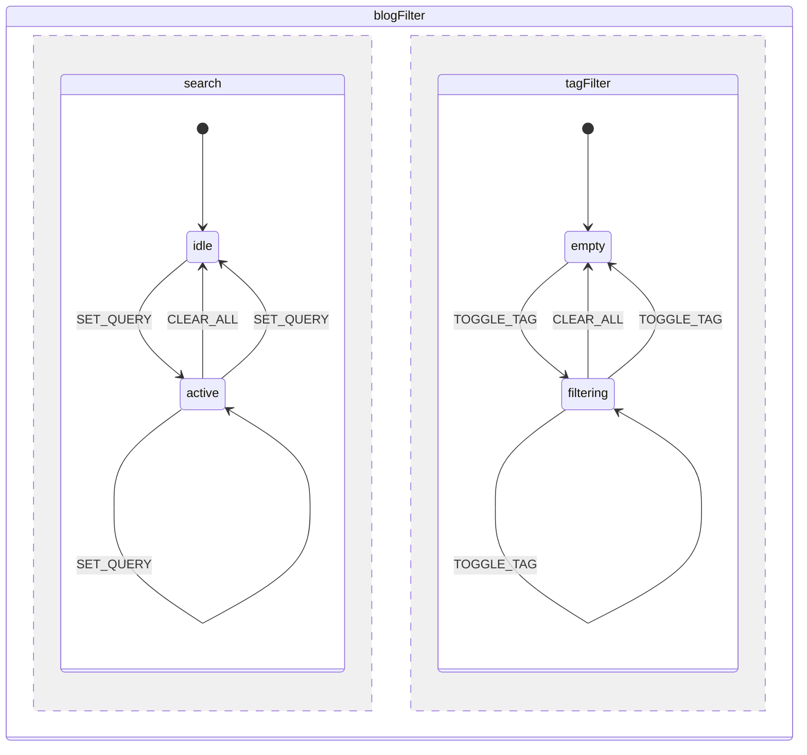
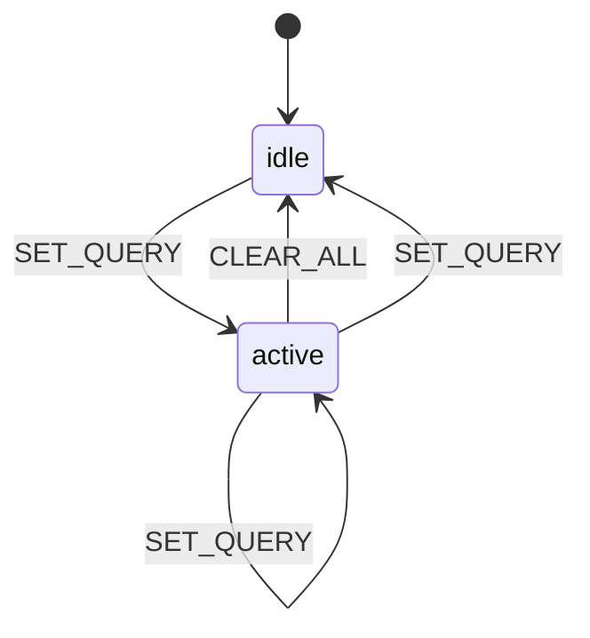
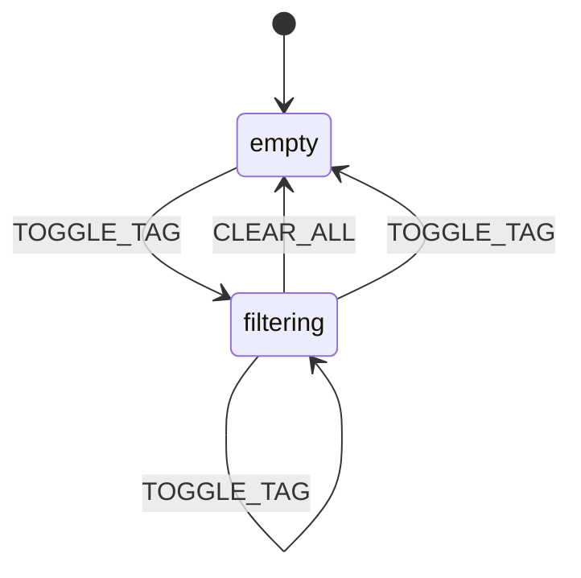

# State Machine Diagrams

Auto-generated from XState machine configurations via `pnpm tsx scripts/generate-state-diagrams.ts`.
GitHub renders these diagrams natively — no build step needed.

<!-- generated: 2026-02-27T02:42:01.114Z -->

## blogFilter

## search

## tagFilter

